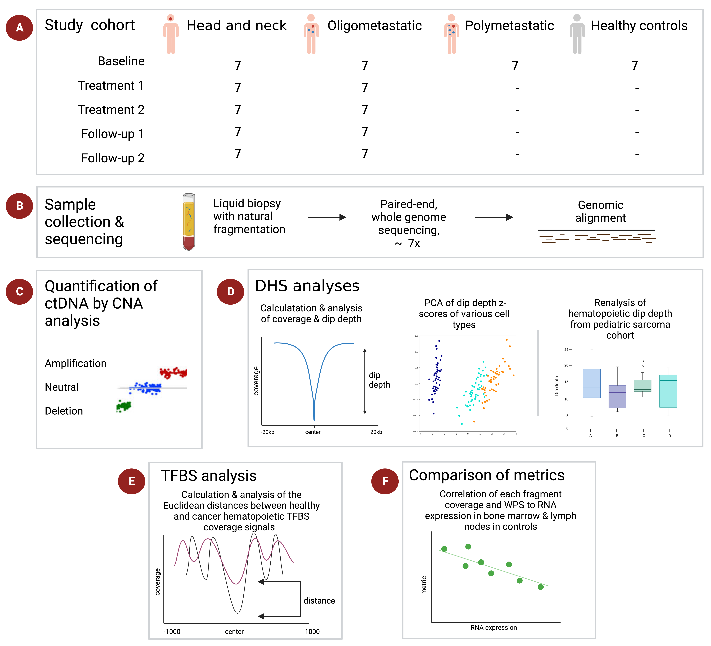

# Hematopoietic cell-free DNA distinguishes cancer patients with low tumor fraction from healthy controls

## About this Repository
This repository contains the code written for the Bioinformatics MSc Project module at [**Birkbeck, University of London**](https://www.bbk.ac.uk/). This work was undertaken over the course of a semester in the [**Krauthammer Lab**](https://krauthammerlab.ch/) at the University of Zurich, where my primary supervior was Zsolt Balázs, MD, PhD. 

## Project Abstract
Liquid biopsies of blood cell-free DNA (cfDNA) and circulating tumor DNA (ctDNA) enable minimally invasive cancer detection and monitoring. Various cfDNA and ctDNA analytic techniques readily detect cancer in samples when tumor fraction, the fraction of ctDNA to cfDNA in a sample, is high. However, cancer is often not detected in samples with low tumor fraction. Here, we show that hematopoietic cfDNA is a potential cancer biomarker in samples with low tumor fraction. In our prospective, radiotherapy cohort of 21 cases and 7 controls, we find that the hematopoietic DNAse I hypersensitivity site (DHS) signals are significantly different in cancer samples with low tumor fraction compared to control samples. These signals also explain most of the variance in our cohort. In addition, our reanalysis of data from a published cohort of 86 pediatric sarcoma samples with low tumor fraction reveals significant differences between control and case hematopoietic DHS signals at diagnosis, therapy, relapse and remission. Furthermore, signals of hematopoietic transcription factor binding sites (TFBS) of 41 out of 56 of our low tumor fraction samples are significantly different from controls. These findings demonstrate the value of non-tumor cfDNA in cancer detection.

## Respository Contents

**(A/B)** Information about the [study cohort and samples](sample_info.csv) 
**(C)** [ichorCNA](output/ichorCNA_plots.pdf)1 and [t-MAD](output/tMAD_CNA_plots.pdf)2 copy number abberation (CNA) plots 
**(D)** [LIQUORICE3 DHS data output and plots](output/LIQUORICE/), script for the [PCA](PCA) of dip depth z-scores, scripts for the [reanalysis of a pediatric sarcoma cohort](Peneder)4 
**(E)** [TFBS  package](disTF) and [data output](output/TFBS/) 
**(F)** Scripts comparing [fragment coverage and windowed protection score (WPS)](coverage_WPS) at promoter regions 
 

### References
1. Adalsteinsson, V. A. et al. Scalable whole-exome sequencing of cell-free DNA reveals high concordance with metastatic tumors. Nature Communications 8, 1–13 (2017). 
2. Mouliere, F. et al. Enhanced detection of circulating tumor DNA by fragment size analysis. Science Translational Medicine 10, (2018). 
3. Peneder, P., Bock, C. & Tomazou, E. M. LIQUORICE: detection of epigenetic signatures in liquid biopsies based on whole-genome sequencing data. Bioinformatics Advances 2, (2022). 
4. Peneder, P. et al. Multimodal analysis of cell-free DNA whole-genome sequencing for pediatric cancers with low mutational burden. Nature Communications 12, (2021).
