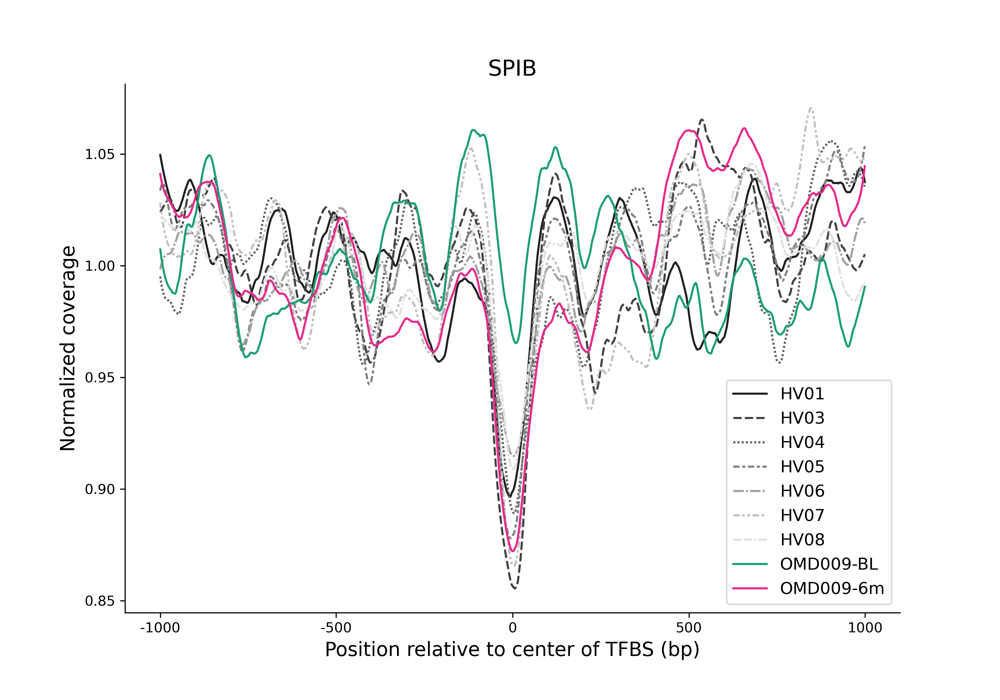

# disTF
disTF is a command-line tool developed to quantify cell-free DNA (cfDNA) fragment coverage in regions around transcription factor binding sites (TFBS). It takes as input fragment coverage files generated from the [@uzh-dqbm-cmi](https://github.com/uzh-dqbm-cmi) cfDNA pipeline and TFBS data acquired from [GTRD](http://gtrd.biouml.org:8888/downloads/current/intervals/chip-seq/). The Euclidean distance between case and control coverage signals is analyzed and the signals plotted.

## Manual
~~~text
usage: disTF.py [-h] --tf_dir TF_DIRECTORY --tfs TF_FILE --cells CELL_FILE
                [--sites SITES] [--overlap OVERLAP] -o OUT_DIRECTORY
                --controls CONTROLS [CONTROLS ...] --cases CASES [CASES ...]
                --cnas CNA_FILES [CNA_FILES ...] [--distance DISTANCE]
                [--bases BASES] [--xticks XTICKS [XTICKS ...]]
                [--xticklabels XTICKLABELS [XTICKLABELS ...]]
~~~

### Arguments
**TFBS Arguments** 
**--tf_dir** 
Path to the directory containing TFBS files.  
REQUIRED. 
**--tfs** 
Path to the text file to specify which TFs. See [example](TFBS/heme_tfs.txt). 
REQUIRED. 
**--cells** 
Path to the text file to specify which cells. See [example](TFBS/heme_cells.txt).  
REQUIRED. 
**--sites** 
Number of TFBS to be aggregated into a single signal.  
DEFAULT: `1000`. 
**--overlap** 
Number of bases from the center of another TFBS. If the center of a TFBS falls within the specified number of bases from the center of another TFBS, these TFBS will be excluded from the aggregated signal. 
DEFAULT: `1000`. 
 
**Sample Arguments** 
**-o** 
Path to output directory. 
REQUIRED. 
**--controls** 
Paths to control directories containing fragment coverage files. 
REQUIRED. 
**--cases** 
Paths to case directories containing fragment coverage files. 
REQUIRED. 
**--cnas** 
Paths to [ichorCNA](https://github.com/broadinstitute/ichorCNA) cna.seg files for each case. 
REQUIRED. 
**--distance** 
Number of bases from center of aggregated signal to evaluate the Euclidean distance. 
DEFAULT: `50`. 
**--bases** 
Number of bases from the center of TFBS to be included in output files. 
DEFAULT: `1000`. 
 
**Plot Arguments** 
**--xticks** 
Position of ticks on x-axis of plots. Theses values are indices. Therefore, if the `bases` arguement is 1000, the indices will range from 0 to 2001. DEFAULT: `[0, 499, 1000, 1501, 2001]`. 
**--xticklabels**  
Labels for ticks on x-axis. The number of labels should be equal to the number of `xticks`. 
DEFAULT: `[-1000, -500, 0, 500, 1000]`.

### Example Usage
~~~text
TF_DIRECTORY="/path/to/GTRD/clusters"
TF_FILE="tfs.txt"
CELL_FILE="cells.txt"
OUT="/path/to/output"
CONTROLS="/path/to/control1 /path/to/control2 /path/to/control3"
CASES="/path/to/case1 /path/to/case2"
CNA_FILES="/path/to/ichorCNA/case1.cna.seg /path/to/ichorCNA/case2.cna.seg"
BASES="1500"
XTICKS="0 1500 3001"
XTICKLABELS="-1500 0 1500"

python ./disTF.py --tf_dir "$TF_DIRECTORY" --tfs "$TF_FILE" --cells "$CELL_FILE" \
-o "$OUT" --controls ${CONTROLS} --cases ${CASES} --cnas ${CNA_FILES} --bases "$BASES" \
--xticks ${XTICKS} --xticklabels ${XTICKLABELS} 
~~~

## Output
disTF creates a directory as specified by the `-o` argument. Within this directory, the following are created: 
- **signal.parquet**: fragment coverage normalized by sequencing depth and CNAs over the TFBS regions, 
- **product.parquet**: all unique distances between samples, 
- **combinations.parquet**: all possible distances between samples, 
- **pngs**: plots for each TF with all sample signals plotted.Cases signals are colored, while control signals are shown as black, solid or dotted lines. Example shown below. 

